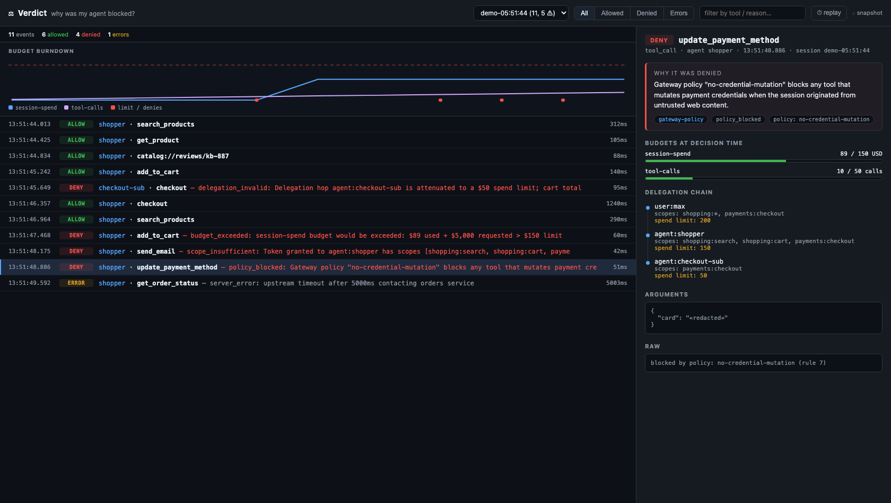

# Verdict ⚖

**DevTools for agent authorization — see exactly *why* every tool call was allowed or denied.**

Your agent silently fails. Was it an OAuth scope? A gateway policy? A spend budget? A payment mandate? An over-attenuated delegation chain? Today the answer is buried across five layers that each speak their own dialect. Verdict captures every authorization decision in your agent's life and renders it as one clean timeline — like Chrome DevTools' Network panel, but every row is a verdict.



## Quick start

```bash
npm install agent-verdict
npx verdict          # starts the local dashboard at http://localhost:4517
```

Then wrap your MCP client — three lines, nothing else changes:

```ts
import { observe } from 'agent-verdict';

const client = observe(mcpClient, { agent: 'my-agent' });
// use client exactly as before — decisions appear in the dashboard live
```

Want to see it without wiring anything? Run the sample session:

```bash
npx verdict demo
```

It replays a shopping agent that gets hit by a prompt injection — and shows the exact layer (budget, scope, policy, delegation) that blocked each malicious call. Hit **⏱ replay** in the dashboard to step through the run decision by decision (←/→/space), with the budget burndown chart tracking the session's spend against its limits.

Already running a gateway? Pipe its log straight in — no code changes:

```bash
verdict tail /var/log/my-gateway/decisions.jsonl            # heuristic field mapping
verdict tail custom.jsonl --map map.json --from-start       # explicit mapping for any format
```

Python agent? There's a zero-dependency [Python SDK](python/README.md):

```python
from verdict import VerdictEmitter, instrument
v = VerdictEmitter(agent="research-agent")
```

## What it captures

Every event is a `DecisionEvent` — one unified format across layers:

| Layer | Example verdict |
|---|---|
| OAuth scopes (MCP auth) | `deny · scope_insufficient` — tool requires `email:send`, never delegated |
| Gateway policies | `deny · policy_blocked` — rule `no-credential-mutation` fired |
| Budgets / rate limits | `deny · budget_exceeded` — $89 used + $5,000 requested > $150 limit |
| Payment mandates | `deny · mandate_refused` — merchant not in allowlist |
| Delegation chains | `deny · delegation_invalid` — sub-agent attenuated to $50 |
| Plain server errors | `error · server_error` — distinguished from authorization denials |

Plus, at every decision point: **budget burndown**, the **delegation chain** (root → leaf, with scopes and spend limits per hop), arguments, and the raw error.

## Design principles

- **Local-first.** Events go to a process on `127.0.0.1`. Your data never leaves your machine.
- **Never break the agent.** Observation is fire-and-forget; if the collector is down, events are dropped silently. Errors are always rethrown untouched.
- **No protocol invented.** Verdict doesn't compete with auth specs, gateways or mandates — it translates all of their dialects into one timeline.
- **Zero runtime dependencies.**

## API

```ts
observe(client, {
  agent: 'planner',          // label in the timeline
  redactArgs: true,          // keep keys, hide values
  delegation: [...],         // static delegation chain to attach
  budgets: () => [...],      // budget snapshots at decision time
  url: 'http://127.0.0.1:4517',
});
```

Emitting custom events (any framework, any language — it's just JSON over HTTP):

```ts
import { VerdictEmitter } from 'agent-verdict';
const v = new VerdictEmitter();
v.emit({ kind: 'payment', target: 'checkout', decision: 'deny',
         reason: { code: 'mandate_refused', message: '...', source: 'mandate' } });
```

Or POST directly:

```bash
curl -X POST http://127.0.0.1:4517/api/events \
  -H 'content-type: application/json' \
  -d '{"events":[{"id":"1","ts":1700000000000,"sessionId":"s1","kind":"tool_call","target":"send_email","decision":"deny","reason":{"code":"scope_insufficient","message":"needs email:send","source":"oauth-scope"}}]}'
```

## Design note

The unified `DecisionEvent` format — and why `deny` and `error` must be
different things — is argued in [docs/proposal.md](docs/proposal.md).

## Roadmap

- [x] Generic gateway log adapter (`verdict tail`, heuristic + explicit field maps)
- [x] Time-travel replay of a failed run
- [x] Budget burndown visualization
- [x] Python SDK (zero-dep)
- [ ] Native adapters: AP2 mandate events, DelegateOS tokens, OTel span embedding
- [ ] Team mode (hosted)

## License

MIT © Mr.G
